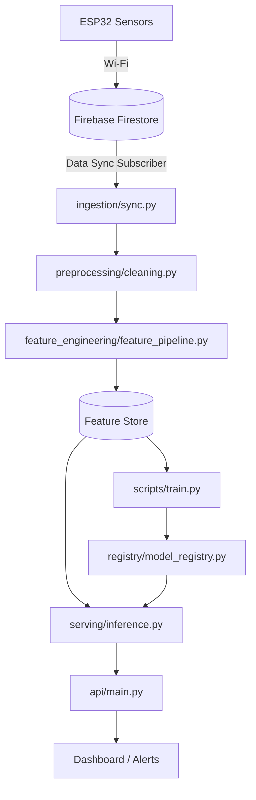

# Agricultural Crop Health and Harvest Prediction System

An AI and IoT-based smart agriculture system for crop health monitoring, disease detection, environmental analysis, and harvest prediction using sensor data, computer vision, and machine learning to enable precision farming, improve productivity, and support data-driven agricultural decision-making.

---

## 📋 Table of Contents
- [Project Overview](#project-overview)
- [Architecture & Flow](#architecture--flow)
- [Folder Structure](#folder-structure)
- [Tech Stack](#tech-stack)
- [ML Pipeline](#ml-pipeline)
- [Dataset Structure](#dataset-structure)
- [Installation](#installation)
- [Usage](#usage)
- [Team Responsibilities](#team-responsibilities)
- [Contribution Guide](#contribution-guide)

---

## 🔍 Project Overview
This project constitutes the **Data Science & Analytics Module** of an Intelligent Indoor Environment Agriculture Monitoring System.
Incoming real-time IoT streams from ESP32 edge units are synchronized via Firebase Firestore, processed, and evaluated through predictive pipelines:
- **Anomaly Detection**: Flags sensor errors, extreme environment conditions, or failure states.
- **Crop Health Prediction**: Multi-class classification models diagnosing plant stress indices.
- **Yield Prediction**: Regression models forecasting expected harvest output.
- **Intelligent Recommendation Engine**: Suggests optimal dynamic setpoints (temp, light, humidity, soil metrics) using a constraints-based optimizer.

---

## 🏗️ Architecture & Flow
Detailed architectures are stored under `assets/architecture/`.



---

## 📁 Folder Structure
Please refer to [CONTRIBUTING.md](CONTRIBUTING.md) for the coding standards.
- **`configs/`**: YAML templates for environment settings, crop rules, model hyperparameters, and telemetry validation.
- **`data/`**: Data versioning pipeline steps (`raw`, `interim`, `processed`, `synthetic`, `metadata`).
- **`datasets/`**: Crop agronomy profiles, public benchmarking, labels, and generated test sets.
- **`docs/`**: Engineering plans, API references, architecture layouts, sensor sheets, and deployment playbooks.
- **`models/`**: Serialized active weights and checkpoint definitions for production models.
- **`notebooks/`**: Phase-specific development files (EDA, Feature Selection, Explainability).
- **`reports/`**: Automatically generated HTML/PDF evaluations, drift metrics, and figures.
- **`scripts/`**: Orchestration entry points for batch training, serving exports, inference, and evaluation.
- **`src/`**: Core application package logic.
- **`tests/`**: Integration and unit testing suite.

---

## 🛠️ Tech Stack
- **Core Framework**: Python 3.10, FastAPI, Uvicorn
- **Data Engineering**: Pandas, NumPy, Firebase Admin SDK
- **Machine Learning**: Scikit-Learn, XGBoost, SHAP
- **Developer Tooling**: Ruff, Black, MyPy, pytest, pre-commit

---

## 🧬 ML Pipeline
1. **Ingestion**: Subscribes to Firestore database updates, parses schema packets, and synchronizes streams.
2. **Preprocessing**: Normalizes values, imputes missing data, and clips/flags outlier values.
3. **Feature Engineering**: Calculates biological indexes like VPD (Vapor Pressure Deficit), DLI (Daily Light Integral), and GDD (Growing Degree Days).
4. **Predictive Scoring**: Compares sensor states against target baseline ranges to identify crop health and projected yield.
5. **Explainability**: Applies SHAP to explain how environmental indicators influenced the outputs.

---

## 📦 Dataset Structure
Data assets are segregated into subfolders under `data/` and `datasets/`:
- `data/raw/`: Original sensor data payload JSONs.
- `data/processed/`: Scaled and aggregated hourly database matrices.
- `datasets/crop_profiles/`: Growth conditions rules for target crops.

---

## 🚀 Installation
```bash
git clone https://github.com/sujaldev28/Agricultural_Crop_Health_and_Harvest_Prediction_System.git
cd Agricultural_Crop_Health_and_Harvest_Prediction_System
python -m venv .venv
source .venv/bin/activate  # On Windows: .venv\Scripts\activate
pip install -r requirements.txt
pre-commit install
```

---

## 💻 Usage
- **Train Models**:
  ```bash
  python scripts/train.py --config configs/config.yaml
  ```
- **Run Serving API**:
  ```bash
  uvicorn src.api.main:app --host 0.0.0.0 --port 8000
  ```

---

## 👥 Team Responsibilities
- **IoT & Hardware Team**: Deploys ESP32 units, handles telemetry streaming, and MQTT configs.
- **Backend & Cloud Team**: Manages Firebase Firestore instances, routes, and webhook servers.
- **MLOps Team**: Designs training pipelines, handles version control, and oversees model deployment.
- **Data Science Team**: Conducts feature analysis, engineers model stubs, and tunes predictor models.

---

## 🤝 Contribution Guide
Please read [CONTRIBUTING.md](CONTRIBUTING.md) and adhere to the guidelines. All contributions must run lint checks and write unit tests.
