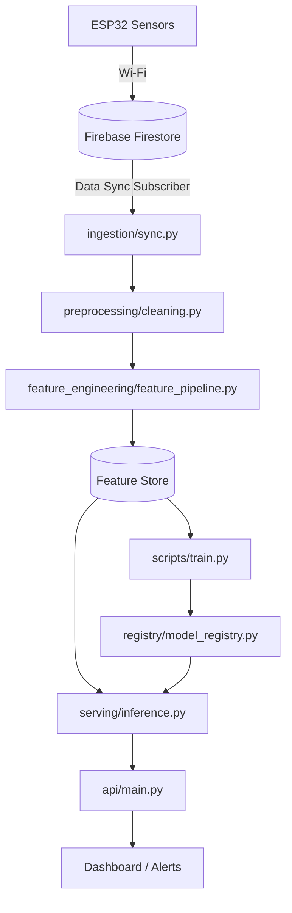

# Agricultural Crop Health and Harvest Prediction System

An AI and IoT-based smart agriculture system for crop health monitoring, disease detection, environmental analysis, and harvest prediction using sensor data, computer vision, and machine learning to enable precision farming, improve productivity, and support data-driven agricultural decision-making.

---

## 📋 Table of Contents
- [Project Overview](#project-overview)
- [Architecture & Flow](#architecture--flow)
- [Directory Structure](#directory-structure)
- [Sensor Data Specification](#sensor-data-specification)
- [Installation & Setup](#installation--setup)
- [Model Registry & Monitoring](#model-registry--monitoring)
- [Testing](#testing)

---

## 🔍 Project Overview
This project constitutes the **Data Science & Analytics Module** of an Intelligent Indoor Environment Agriculture Monitoring System.
Incoming real-time IoT streams from ESP32 edge units are synchronized via Firebase Firestore, processed, and evaluated through predictive pipelines:
- **Anomaly Detection**: Flags sensor errors, extreme environment conditions, or failure states.
- **Crop Health Prediction**: Multi-class classification models diagnosing plant stress indices.
- **Yield Prediction**: Regression models forecasting expected harvest output.
- **Intelligent Recommendation Engine**: Suggests optimal dynamic setpoints (temp, light, humidity, soil metrics) using a constraints-based optimizer.

---

## 🏗️ Architecture & Flow


---

## 📁 Directory Structure
Below is an overview of the modular packaging system designed for high scalability:

- **`configs/`**: YAML templates for environment settings, crop rules, model hyperparameters, and telemetry validation.
- **`data/`**: Data versioning pipeline steps (`raw`, `interim`, `processed`, `synthetic`, `metadata`).
- **`datasets/`**: Crop agronomy profiles, public benchmarking, labels, and generated test sets.
- **`docs/`**: Engineering plans, API references, architecture layouts, sensor sheets, and deployment playbooks.
- **`models/`**: Serialized active weights and checkpoint definitions for production models.
- **`notebooks/`**: Phase-specific development files (EDA, Feature Selection, Explainability).
- **`reports/`**: Automatically generated HTML/PDF evaluations, drift metrics, and figures.
- **`scripts/`**: Orchestration entry points for batch training, serving exports, inference, and evaluation.
- **`src/`**: Core application package logic.
  - `common/`: Shared schemas, validators, exceptions, and global logger settings.
  - `ingestion/`: Firestore stream subscription, custom parsers, and loaders.
  - `preprocessing/`: Raw timeseries cleaning, imputation, and normalizing.
  - `feature_engineering/`: Real-time agriculture indices (e.g. Vapor Pressure Deficit, Daily Light Integral, GDD).
  - `feature_store/`: Multi-source data registry and feature builder.
  - `models/`: Submodule stubs containing training and predictor class wrappers.
  - `decision_engine/`: Agronomic rules, optimization setpoint calculations.
  - `monitoring/`: Real-time data and concept drift alerts.
  - `serving/`: Production-grade API inference handlers and post-processors.
  - `api/`: FastAPI routes, middleware, and dependency definitions.
- **`tests/`**: Integration and unit testing suite.

---

## ⚡ Sensor Data Specification
Each ingested record is typed and validated against the following schema:
- **`temperature`**: Ambient temperature in °C.
- **`humidity`**: Relative Humidity (RH %).
- **`air_quality`**: Carbon Dioxide levels (CO₂ in ppm).
- **`light_intensity`**: Light illuminance levels (Lux).
- **`soil_moisture`**: Soil moisture percentage (VWC %).
- **`soil_ph`**: Soil acidity/alkalinity scale.
- **`electrical_conductivity`**: Soil EC level (dS/m).
- **`timestamp`**: UTC Datetime.
- **`sensor_id`** / **`device_id`** / **`zone_id`**: Device topology mapping.
- **`crop_type`**: Targeted crop identifier (e.g., `tomato`, `lettuce`).

---

## 🚀 Installation & Setup
1. Clone the repository:
   ```bash
   git clone https://github.com/sujaldev28/Agricultural_Crop_Health_and_Harvest_Prediction_System.git
   cd Agricultural_Crop_Health_and_Harvest_Prediction_System
   ```
2. Set up virtual environment & install requirements:
   ```bash
   python -m venv .venv
   source .venv/bin/activate  # On Windows: .venv\Scripts\activate
   pip install -r requirements.txt
   ```
3. Copy environment configuration:
   ```bash
   cp .env.example .env
   ```

---

## 🔬 Testing
Run test discovery using pytest:
```bash
pytest
```
